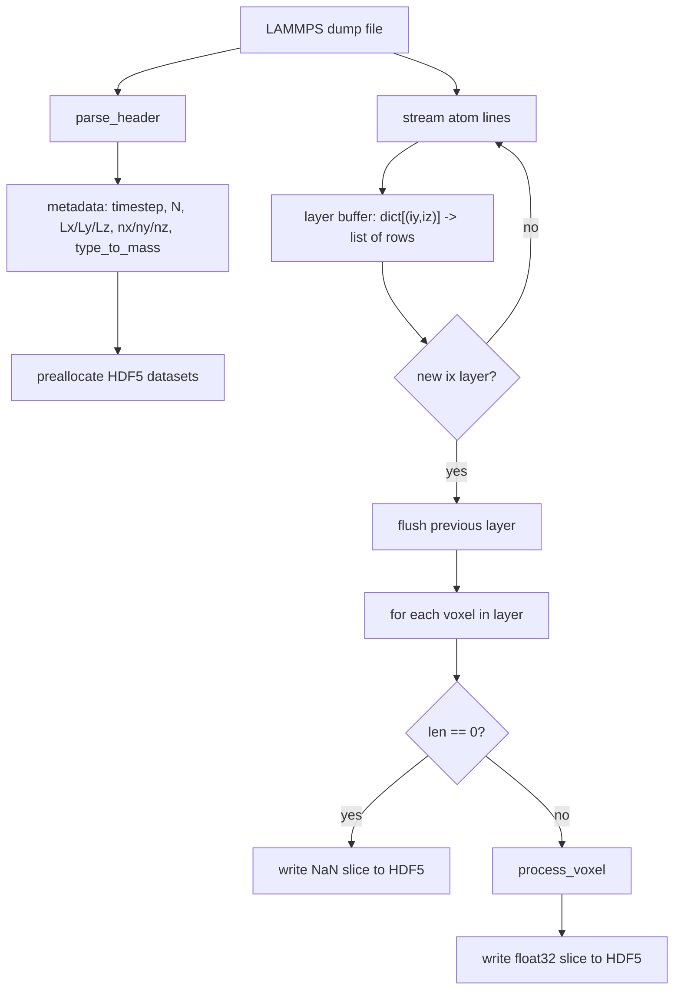

# Shock Voxel Analysis Plan

## Output file
`analysis/shock/shock_analysis.py`

## Architecture



## Entry point
```python
python shock_analysis.py <dump_file> <output.h5> --voxel-size 1.0 --type-map 1:H 2:O 3:Si
```

## Functions

### `parse_header(f) -> dict`
Read lines until `ITEM: ATOMS` line; return:
- `timestep`, `N`, `xlo/xhi/ylo/yhi/zlo/zhi`, `Lx/Ly/Lz`
- `nx, ny, nz = ceil(Lx/vs), ceil(Ly/vs), ceil(Lz/vs)`
- `type_to_mass`: numpy array indexed by int type, values in amu
- `Si_type`, `O_type`: int type IDs for Si and O from type mapping

### `preallocate_hdf5(h5file, nx, ny, nz, attrs) -> h5py.File`
Create all 8 datasets with `fillvalue=np.nan` (or 0 for `voxel_type`), chunk shape `(1, ny, nz)` or `(1, ny, nz, 3)` for v_COM. Write metadata as file attributes.

Datasets:
- `density, pressure, virial_pressure, temperature, avg_speed, avg_O_speed` — `(nx,ny,nz) float32`
- `voxel_type` — `(nx,ny,nz) uint8`, 0=empty, 1=water, 2=silica
- `v_COM` — `(nx,ny,nz,3) float32`

### `process_voxel(arr, masses, V, Si_type, O_type) -> dict`
Inputs: `arr` shape `(N,11)` float64, precomputed `masses` array.

Key computations (all float64 until final cast):
- `r_COM = np.average(arr[:,2:5], axis=0, weights=masses)`
- `v_COM = np.average(arr[:,5:8], axis=0, weights=masses)`
- `r_prime = arr[:,2:5] - r_COM`
- `virial_sum = np.sum(r_prime * arr[:,8:11])`
- `kinetic_term = np.dot(masses, np.sum(arr[:,5:8]**2, axis=1))`
- `v_th = arr[:,5:8] - v_COM`
- `thermal_KE = np.dot(masses, np.sum(v_th**2, axis=1))`
- `T = thermal_KE / (3 * N * k_B)`
- `density = total_mass / V` (V in ų, convert to g/cm³)
- `voxel_type = 2 if Si_type in types else 1`
- `avg_O_speed`: only if `voxel_type == 1`, else NaN

Returns dict of float32-cast values ready to write.

### `flush_layer(layer_buf, ix, h5file, nx, ny, nz, ...)` 
Iterate over all `(iy, iz)` in current layer, call `process_voxel` or write NaN, write each result into `h5file['density'][ix, iy, iz]` etc.

### `main()`
- Parse args
- Open dump, call `parse_header`
- Open HDF5, call `preallocate_hdf5`
- Stream atom lines, accumulate into `layer_buf = defaultdict(list)`
- On ix change: call `flush_layer`, clear buffer
- After EOF: flush final layer

## Units note
LAMMPS real units: positions in Å, velocities in Å/ps, forces in kcal/mol/Å, masses in amu.
- Pressure: result of `(kinetic + virial) / (3V)` will be in kcal/mol/ų — convert to GPa (1 kcal/mol/ų ≈ 6.9479 GPa)
- Temperature: `k_B = 8.617e-5 eV/K = 1.9872e-3 kcal/mol/K`
- Density: `total_mass_amu * 1.6605e-27 kg / (V_ų * 1e-30 m³)` → kg/m³, or convert amu/ų to g/cm³ (factor: 1.6605)
