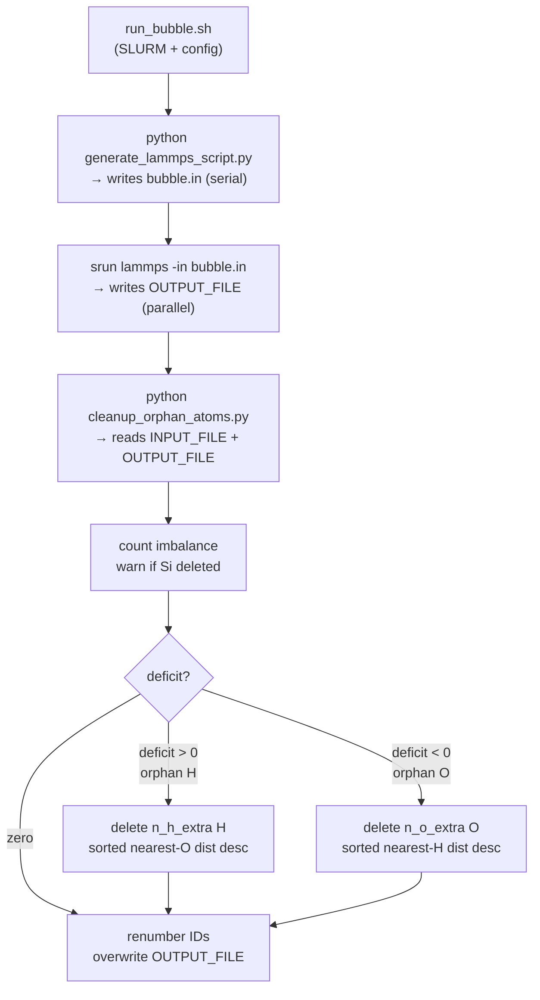

# Atomic Style Orphan Atom Cleanup

## Problem
`atom_style atomic` has no molecule-ID field. `delete_atoms region bubble mol yes` in [`create_bubble.in`](simulation/md_setup/create_bubble.in) and the generated script in [`bubble_setup.py`](simulation/md_setup/bubble_setup.py) silently misbehaves — with all atoms sharing molecule-ID 0, it would delete every atom that shares that ID (potentially everything). Must be replaced.

## New file structure

```
simulation/md_setup/
├── run_bubble.sh                # top-level SLURM orchestrator — config lives here
├── generate_lammps_script.py   # writes the LAMMPS .in file, CLI args
├── cleanup_orphan_atoms.py     # Python cleanup phase, CLI args
├── lammps_utils.py             # shared helpers: read_header(), count_atoms_by_type()
├── bubble_setup.py             # DEPRECATED (see note)
└── create_bubble.in            # DEPRECATED (see note)
```

`bubble_setup.py` is split: script-generation logic (minus the filler-file feature, which is dropped) moves to `generate_lammps_script.py`. Shared parsing helpers `read_header()` and `count_atoms_by_type()` live in `lammps_utils.py` and are imported by both new scripts. The `subprocess` LAMMPS invocation and `create_bubble()` entry point are removed — SLURM/bash owns execution.

## Workflow



## `run_bubble.sh` (SLURM batch script)

```bash
#!/bin/bash
#SBATCH --account=priyav_216
#SBATCH --nodes=1
#SBATCH --ntasks=64
#SBATCH --partition=priya
#SBATCH --time=01:00:00
#SBATCH --mem=0
#SBATCH --exclusive
#SBATCH --output=bubble_%j.out
#SBATCH --job-name=create_bubble
#SBATCH --constraint=epyc-7513
#SBATCH --mail-type=all
#SBATCH --mail-user=lkyamamo@usc.edu

set -e
ulimit -s unlimited

# ── config ────────────────────────────────────────────────────────────────────
INPUT_FILE="system.data"
OUTPUT_FILE="system_bubble.data"
SCRIPT_FILE="bubble.in"

CX=400.0; CY=400.0; CZ=881.0
RADIUS=150.0
SHELL_THICKNESS=2.0

O_TYPE=2
H_TYPE=3
SI_TYPE=1

export lmp="/home1/lkyamamo/executables/lammps/lmp_mpi_2019"
VENV_DIR="/path/to/venv"         # absolute path to virtualenv with numpy/scipy
SCRIPT_DIR="$(cd "$(dirname "${BASH_SOURCE[0]}")" && pwd)"
# ─────────────────────────────────────────────────────────────────────────────
# Job is submitted from the directory containing INPUT_FILE.
# All relative paths (INPUT_FILE, OUTPUT_FILE, SCRIPT_FILE) resolve against
# SLURM_SUBMIT_DIR, which is the cwd for all three steps.
# ─────────────────────────────────────────────────────────────────────────────

echo "starting bubble creation **************************************"
date

module purge
module load usc
module load fftw

source "${VENV_DIR}/bin/activate"

# Step 1: generate the LAMMPS input script (serial)
echo "Generating LAMMPS input script..."
python3 "${SCRIPT_DIR}/generate_lammps_script.py" \
    --input  "$INPUT_FILE"  \
    --output "$OUTPUT_FILE" \
    --script "$SCRIPT_FILE" \
    --cx "$CX" --cy "$CY" --cz "$CZ" \
    --radius "$RADIUS"

# Step 2: run LAMMPS in parallel
echo "Running LAMMPS..."
srun --mpi=pmix_v5 -n $SLURM_NTASKS $lmp \
    -log log.lammps \
    -in "$SCRIPT_FILE"

# Step 3: Python orphan atom cleanup (serial)
echo "Running orphan atom cleanup..."
python3 "${SCRIPT_DIR}/cleanup_orphan_atoms.py" \
    --original "$INPUT_FILE"  \
    --data     "$OUTPUT_FILE" \
    --cx "$CX" --cy "$CY" --cz "$CZ" \
    --radius "$RADIUS" \
    --shell-thickness "$SHELL_THICKNESS" \
    --o-type "$O_TYPE" \
    --h-type "$H_TYPE" \
    --si-type "$SI_TYPE"

date
echo "bubble creation finished **************************************"

exit 0
```

`set -e` ensures the job aborts immediately if any step fails (preventing LAMMPS from running on a missing `.in` file, or cleanup from running on a corrupt output). `VENV_DIR` is an absolute hardcoded path. `SCRIPT_DIR` resolves the directory of the script itself so Python scripts are always found regardless of submit location. Steps 1 and 3 run serially; only LAMMPS uses `srun --mpi=pmix_v5`.

## `lammps_utils.py`
Shared module imported by both new scripts. Contains:
- `read_header(data_file) -> dict[str, int]` — streams the header block, returns counts for `n_atoms`, `n_atom_types`, etc.
- `count_atoms_by_type(data_file) -> dict[int, int]` — streams the `Atoms` section (`atom-ID type x y z` for `atom_style atomic`), returns `{type_id: count}`.

## `generate_lammps_script.py`
- Accepts CLI args (argparse) for all geometry and file paths.
- Contains `_bubble_regions()` and script-generation logic from `bubble_setup.py`, updated to emit `mol no`.
- The filler-file insertion feature from `bubble_setup.py` is **dropped** — not included here.
- Writes the `.in` file to `--script` path and exits. No subprocess calls.

## `cleanup_orphan_atoms.py`

**Imbalance calculation**
- `count_atoms_by_type(file)` streams the `Atoms` section (`atom-ID type x y z`) and returns `{type: count}`.
- Compare Si (type 1) counts before/after; emit `warnings.warn` if any Si was deleted (bubble intersects silica; deficit unreliable).
- `deficit = 2 * n_O_deleted - n_H_deleted`
  - `deficit > 0` → orphan H: `n_h_extra = deficit`
  - `deficit < 0` → orphan O: `surplus = -deficit`; `n_o_extra = surplus // 2`; `odd_remainder = surplus % 2`
  - `deficit == 0` → skip to renumber/write

**Phase 2a — Orphan H** (`deficit > 0`)
- Shell H: type == `h_type` and `radius < dist_from_center <= radius + shell_thickness`
- If shell has fewer H than `n_h_extra`: warn, expand shell by +0.1 Å, retry ≤5 times, then `raise RuntimeError`.
- `KDTree` on remaining O positions; query nearest-O dist for each shell H.
- Log all shell H: atom-ID, nearest-O dist, `[DELETE]` or `[KEEP]`.
- Sort descending, delete top `n_h_extra`.

**Phase 2b — Orphan O** (`deficit < 0`)
- Shell O: type == `o_type` and `radius < dist_from_center <= radius + shell_thickness`
- Adaptive shell expansion same as above (≤5 retries).
- `KDTree` on remaining H positions; query nearest-H dist for each shell O.
- Log all shell O: atom-ID, nearest-H dist, `[DELETE]` or `[KEEP]`.
- Sort descending, mark top `n_o_extra` for deletion.
- If `odd_remainder == 1`: rebuild KDTree excluding marked O atoms; query nearest-O dist for all shell H; log all shell H with `[DELETE]`/`[KEEP]`; delete the single most-isolated H.

**Phase 3 — Finalize**
- Filter Atoms section, update atom count in header, renumber IDs sequentially (1, 2, 3, …).
- Overwrite `--data` file in-place.

## Deprecated files
- [`bubble_setup.py`](simulation/md_setup/bubble_setup.py) — add docstring note: superseded by `generate_lammps_script.py` + `cleanup_orphan_atoms.py` + `run_bubble.sh`.
- [`create_bubble.in`](simulation/md_setup/create_bubble.in) — add header comment: DEPRECATED, `mol yes` does not work with `atom_style atomic`; use `run_bubble.sh` instead.

## Notes
- Multi-center bubbles: cleanup uses the first center only; extend for multi-center if needed.
- `scipy` and `numpy` are already in `pyproject.toml` — no new dependencies needed.
